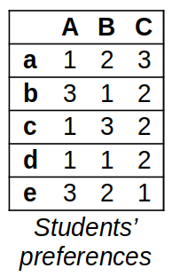

---
jupytext:
  formats: ipynb,md:myst
  text_representation:
    extension: .md
    format_name: myst
    format_version: 0.13
    jupytext_version: 1.11.5
kernelspec:
  display_name: Python 3 (ipykernel)
  language: python
  name: python3
---

# Final Exam's Resit
**FIZ371 - Scientific & Technical Calculations | 29/01/2024**

Emre S. Tasci <emre.tasci@hacettepe.edu.tr>
Eng. Physics Dept.  
Hacettepe University  
Ankara, Turkey

You can solve the problems analytically or stochastically, it's up to you. You can present your solution having been calculated on a paper, or as a jupyter notebook, or as a mixture of both.

* Please prepare one jupyter notebook per question.
* You can use any predefined function from numpy, scipy, math, pandas, random, collections and matplotlib modules -- for any other external module/library you should first ask for permission.
* Before submitting, download your notebooks as html as well as ipynb format and zip them all.
* Name your zip file as <YourName\>\_FIZ371_Final_Resit.zip (e.g., EmreTasci_FIZ371_Final_Resit.zip)

+++

**Pick any 2 questions, if you have time go for a 3rd one for half the points (25) as bonus. Good luck! 8)**

+++

## 1. Probability

An unbiased coin is flipped until one head is thrown. What is the expected number of tails and the expected number of heads?

+++

## 2. Neural Networks

Define the activity rule of a neuron that performs the following table:

|$x_1$|$x_2$|$y$|
|---|---|---|
|0|0|1|
|0|1|0|
|1|0|1|
|1|1|0|

If the above table isn't rendered properly, here it is in text format:

<pre>
x1|x2| y
 0| 0| 1
 0| 1| 0
 1| 0| 1
 1| 1| 0
</pre>

_You can use more than one neuron if you have trouble solving the question with a single one!_

_Don't forget to use the bias signal if you are stuck!_

+++

## 3. Matching Problem

5 students are applying for 3 advisors for their project. An advisor can accept at most 2 students. The preference tables for the students and the advisors are given below, with lowercase letters indicating the students while the uppercase letters indicating the advisors.





In these tables, the same number indicates equal preferences (e.g., Advisor C equally prefers students c and d as their 2nd choice); while a "-" indicates that the advisor won't accept the corresponding student under any condition (i.e., Advisor C has a terrible experience with student e and therefore won't work with them).


a) Find a stable match  
b) By analyzing, prove that the matching you have acquired is a stable one  
c) Is the matching you have proposed unique?

+++

## 4. Parity Concept

In our university, recently, the id assignment is done as follows:

**Example: 2210334002**

* The first digit indicates the millenium (e.g., '2' for 2000s)
* The 2nd and 3rd digits indicate the entrance year of the student (e.g., '21' for 2021)
* The 4th digit is a seperator, always 0
* The 5th, 6th and 7th digits indicate the department code (e.g., '334' for our department)
* The last three digits indicate the success order of the student (e.g., '002' belongs to the student who entered our department as the top 2nd student)

Come up with a parity concept that will:

1. Reduce the number of data transmitted of the id# of the student
2. It will be able to spot -and hopefully fix- the transmitted data over a noisy channel

**Bonus**
Let's say that the transmission channel has a noise ratio of $\beta = 0.02$: calculate the probability of receiving an undetectable error upon transmission.

+++

## 5. Putting the skills to work

Describe a physical situation/case/problem (that haven't already been covered during this course's lectures) that doesn't have an analytical solution but could be solved using stochastic methods. Suggest the method and also try to implement & apply it to the problem you have proposed.

```{code-cell} ipython3

```
