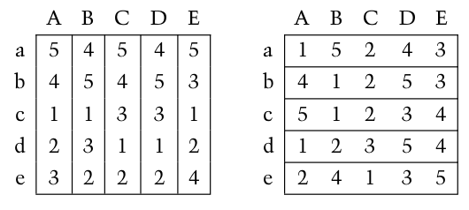

---
jupyter:
  jupytext:
    formats: ipynb,md
    text_representation:
      extension: .md
      format_name: markdown
      format_version: '1.3'
      jupytext_version: 1.11.5
  kernelspec:
    display_name: Python 3 (ipykernel)
    language: python
    name: python3
---

**FIZ371 - Scientific & Technical Calculations | 06/12/2023**

Emre S. Tasci <emre.tasci@hacettepe.edu.tr>  
Eng. Physics Dept.  
Hacettepe University  
Ankara, Turkey

# Midterm Exam
You can solve the problems analytically or stochastically, it's up to you. You can present your solution having been calculated on a paper, or as a jupyter notebook, or as a mixture of both.

* Please prepare one jupyter notebook per question.
* You can use any predefined function from numpy, scipy, math, pandas, random, collections and matplotlib modules -- for any other external module/library you should first ask for permission.
* Before submitting, download your notebooks as html as well as ipynb format and zip them all.
* Name your zip file as <YourName\>\_FIZ371_20231_MT.zip (e.g., EmreTasci_FIZ371_20231_MT.zip)

<center><b><i>Good Luck!</i></b></center>

<center><h2>Pick 4 out of the following 5 questions!</h2></center>

```python
import numpy as np
from scipy import special
import matplotlib.pyplot as plt

```

# 1. Probabilities

A bag holds the following letters, some more than once as you can see:

```
S = ['a', 'c', 'c', 'c', 'f', 'g', 'h', 'i', 'm', 'n', 'n', 'o', 'p','s', 's', 't', 'u', 'y', 'y', 'z']
```

a) What is the probability that randomly picked 5 letters will spell the word 'scout'? (The picking is _with replacement_, i.e., after being picked up and taken note of, the picked letter is returned back to the bag)

b) What is the probability that from randomly picked 10 letters we will be able to spell the word 'scout'? (The picking is _with replacement_)

c) Calculate and plot the probabilities chart/graph of the letters being picked.

d) Calculate the entropy of this system.


## Solution

### a)


#### Monte Carlo Solution

```python
S = np.array(['a', 'c', 'c', 'c', 'f', 'g', 'h', 'i', 'm', 'n', 'n', 'o', 'p','s', 's', 't', 'u', 'y', 'y', 'z'])
```

```python
N = int(1E6)
n = 0
for i in range(N):
    w = np.random.choice(S,5)
    w.sort()
    w = "".join(w)
    #print(w)
    if(w == "costu"):
        n += 1
print("Probability: {:.5f}  ({:d}/{:d})".format(n/N,n,N))
```

#### Analytical Solution

We collect the probability of each one of the letter to be picked in the `probs` dictionary and as the order of the picked letters doesn't matter (e.g., "s,c,o,u,t" and "c,o,s,t,u" are both valid pickings), we calculate the probability of picking one set and multiply it with the total number of different permutations (`special.perm(5,5)` = 120).

```python
N = S.size
probs = {}
for l in np.unique(S):
    #print("{:} : {:}".format(l,sum(S==l)))
    probs[l] = sum(S==l)/N
probs
```

```python
tot_prob = 1
for l in ['s','c','o','u','t']:
    tot_prob *= probs[l]
Total_Probability = tot_prob*special.perm(5,5)
print("{:.5f}".format(Total_Probability))
```

### b)

#### Monte Carlo

```python
N = int(1E6)
n = 0
for i in range(N):
    w = np.random.choice(S,10)
    w = "".join(w)
    #print(w)
    
    # Count the sought letters in the prepared 'word'
    # if we have at least 1 of each letter from "scout"
    # then we are done
    flag_passed = True
    for l in ["s","c","o","u","t"]:
        if(not l in w):
            flag_passed = False
            break
    if(flag_passed):
        #print(w)
        n += 1
print("Probability: {:.5f}  ({:d}/{:d})".format(n/N,n,N))
```

### c)

```python
N = S.size
probs = {}
for l in np.unique(S):
    #print("{:} : {:}".format(l,sum(S==l)))
    probs[l] = sum(S==l)/N
probs
```

```python
plt.bar(list(probs.keys()),list(probs.values()))
plt.show()
```

### d)

```python
H = 0
for l in np.unique(S):
    H += probs[l]*np.log2(probs[l])
H *= -1
print("Entropy: {:.5f}".format(H))
```

# 2. Random Passenger

There is a plane with 100 seats and 100 passengers are starting to board it one by one. The first passenger realizes that they have lost their ticket so they sit to a random seat. The following passengers pick a seat according to these rules:

* If their assigned seat (i.e., the seat with the number that is on their ticket) is available, they sit there,
* If their assigned seat is occupied, they randomly pick an unoccupied seat and sit there.

Calculate the probability that the last passenger will actually be able to get their assigned seat.


## Solution

_As this was a solved-out exercise problem, you can find both the analytical and MC solutions in our course's page_


# 3. Continous Distribution

a) Draw (pick) N = 1000 samples from the Gaussian distribution characterized by 𝜇=5,𝜎=2. Plot the probability distribution using these samples you have obtained.

b) Without using the knowledge of the 𝜇,𝜎 parameters you have used to generate the data, try to recover 𝜇,𝜎  from the samples! (i.e., fit a Gaussian to your data's distribution ;)

c) (Bonus) Try to calculate the area under the curve for various group sizes (Δ𝑥 values). Are they all equal to 1? If not, what do you propose to make the area equal to 1?


## Solution

### a)

```python
N = 1000
mu = 5
sigma = 2
data = np.random.normal(mu,sigma,N)
```

```python
plt.hist(data,bins=20)
plt.show()
```

### b)

```python
mu_p = data.mean()
sigma_p = data.std()
print(mu_p,sigma_p)
```

## 4. Game Theory

Calculate the probabilities for defecting and keeping silent for the prisonner's dilemma game, using the pay-off table below:

$$\begin{matrix}
   & B_s & B_d\\
A_s & 2,2 & 0,3\\
A_d & 3,0 & 1,1
\end{matrix}$$

Find the Nash equilibrium point(s), if any.


## Solution

$$\begin{align}
A_s &= \frac{2B_s}{(2B_s)+(3B_s+B_d)}=\frac{2B_s}{5B_s+B_d},&
A_d &= \frac{3B_s+B_d}{(2B_s)+(3B_s+B_d)}=\frac{3B_s+B_d}{5B_s+B_d}\\
B_s &= \frac{2A_s}{(2A_s)+(3A_s+A_d)}=\frac{2A_s}{5A_s+A_d},&
B_d &= \frac{3A_s+A_d}{(2A_s)+(3A_s+A_d)}=\frac{3A_s+A_d}{5A_s+A_d}
\end{align}
$$

Due to the symmetry, we see that $A_s = B_s$ and $A_d = B_d$, therefore our equations become:

$$A_s = \frac{2A_s}{5A_s+A_d},\quad
A_d = \frac{A_s+A_d}{5A_s+A_d}\\
A_s + A_d = 1$$

Using these equations, we have:

$$A_s = \frac{2A_s}{5A_s+A_d}\rightarrow 5A_s+A_d=2\rightarrow 4A_s+(\underbrace{A_s+A_d}_{1}) = 2
\Rightarrow A_s = \frac{1}{4}$$

Hence: 

$$A_d = 1-A_s = \frac{3}{4},\\ B_s = A_s = \frac{1}{4},\\ B_d = A_d = \frac{3}{4}$$

For the Nash equilibrium, we deduce the logical action of each one of the player in each case where they either stick or switch:


$$\begin{matrix}
   & B_s & & B_d\\
A_s & 2,2& \color{red}{\rightarrow}& 0,3\\
 &\color{blue}{\downarrow}     & &\color{blue}{\downarrow}  \\
A_d & 3,0 &\color{red}{\rightarrow} &\boxed{ 1,1}
\end{matrix}$$

Here, the red arrows indicate the preference directions of $B$ while the blue arrows indicate the preference directions of $A$ upon learning their opponent's response. Thus, the case where they both defect is the only Nash Equilibrium point.


# 5. Matchmaking

Consider the following preference chart:



where capital letters indicate the women and lower cases indicate men.

a) Find a stable matching.  
b) Is the matching you have found unique? If so, why? If not, find another alternative & stable matching.

<!-- #region -->
## Solution

### a)

**Men Propose:**

$$\begin{matrix}
A&B&C&D&E\\
a^*,d&b^*,c&e&&\\
d&c&a^*,b^*,e&&\\
d&c&e&&a^*,b\\
d&c&e&a&b
\end{matrix}$$

<hr>

$$\begin{matrix}
A&B&C&D&E\\
|&|&|&|&|\\
d&c&e&a&b
\end{matrix}$$


**Women Propose:**

$$\begin{matrix}
a&b&c&d&e\\
&&A^*,B,E^*&C,D^*\\
&&B&A,C^*,E^*&D\\
&E&B&A&C,D^*\\
&E&B,D^*&A&C\\
D&E&B&A&C
\end{matrix}$$


<hr>

$$\begin{matrix}
a&b&c&d&e\\
|&|&|&|&|\\
D&E&B&A&C
\end{matrix}$$

### b) 
As the matchings are the same for the men proposing and women proposing cases, this is a unique matching.
<!-- #endregion -->

```python

```
