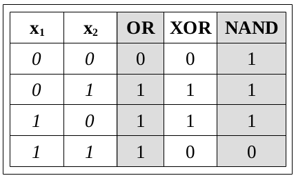
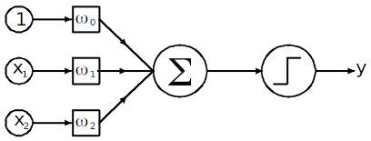

---
jupyter:
  jupytext:
    formats: ipynb,md
    text_representation:
      extension: .md
      format_name: markdown
      format_version: '1.3'
      jupytext_version: 1.11.5
  kernelspec:
    display_name: Python 3 (ipykernel)
    language: python
    name: python3
---

# Resit Exam
**FIZ371 - Scientific & Technical Calculations | 30/01/2023**

Emre S. Tasci <emre.tasci@hacettepe.edu.tr>
Eng. Physics Dept.  
Hacettepe University  
Ankara, Turkey

You can solve the problems analytically or stochastically, it's up to you. You can present your solution having been calculated on a paper, or as a jupyter notebook, or as a mixture of both.

* Please prepare one jupyter notebook per question.
* You can use any predefined function from numpy, scipy, math, pandas, random, collections and matplotlib modules -- for any other external module/library you should first ask for permission.
* Before submitting, download your notebooks as html as well as ipynb format and zip them all.
* Name your zip file as <YourName\>\_FIZ371_Resit.zip (e.g., EmreTasci_FIZ371_Resit.zip)

**Pick any 2 questions, if you have time go for a 3rd one for half the points (25) as bonus. Good luck! 8)**

## 1. Busy Tone

You have started working in a new company. Somebody asks you your office number and you can't be
sure, so you dial the number that you think is yours and you get a busy signal. Since the company is a new
one, you know that there is around 1000 numbers in use (going from 0001 to 1000). 

a) It is around 5 pm, so you estimate that there is around ¼ chance that somebody is using their phone at that
moment. Estimate the probability that the number you have just dialed (and got a busy tone) is
indeed your number.  
b) You dial that number 2 hours later and once again get the busy tone -- now what would you estimate the probability that that number is your number?

## 2. Picking the Winner

You are organizing a chess tournament where the scoring is done as 1 / ½  / 0 upon win, draw or lose, respectively. There are 1000 participants, and due to the high number, you can't hold up a league where everyone plays against all the others nor a fixture where you match the winners to compete against each other in an escalating tournament towards final. 

a) Derive an algorithm that will let you pick the winner as quickly as possible, make sure you explain it in detail.  
b) Calculate its efficiency for 10, 100, 1000 and 10000 participants.

## 3. **_Not_** as the Crow Flies

In a rectangular country that is 100 x 50 unit² (width x height), there are 5 cities located at the following coordinates:

* A City @ (0,0)
* B City @ (10,10)
* C City @ (25,30)
* D City @ (60,15)
* E City @ (80,45)

Three cultural centers are planned to be constructed and they are meant to be placed in the most optimal locations. But the catch is that, the country is filled with mountain ranges, parallel to the West-East line (Like parallel lines drawn parallel to Black Sea up to Mediterrenian), making it twice difficult to travel along North and South directions.

Assuming that the cities' populations are the same, determine the optimal locations for these 3 cultural centers.

_Bonus: determine the locations of the cultural centers for **unevenly** populated cities, e.g., A: 10 million people, B: 20 million, C: 30 million, D: 40 million and E: 50 million._

## 4. AI Gates

Using a single perceptron (an artificial neuron using Heaviside step function) try to construct the following logic gates that are included in the Cayley table given below by properly setting/specifying the weights for each case.

$$\text{Heaviside step function:   } \Theta(x)=\left\{\begin{matrix} x\ge0\rightarrow 1\\x<0\rightarrow 0\end{matrix}\right.$$

_Warning: one or more of the gates might not be achievable by a single perceptron! If you happen to come upon such gate(s), construct a more complex neural network (along with the structure and weights) that is able to simulate it for a bonus of 25 points!_

## 5. Ising Flavoured Cellular Automata

How would you fuse the Ising Model with Cellular Automata? 

Define in detail and present a physical case, going over each step thoroughly.
